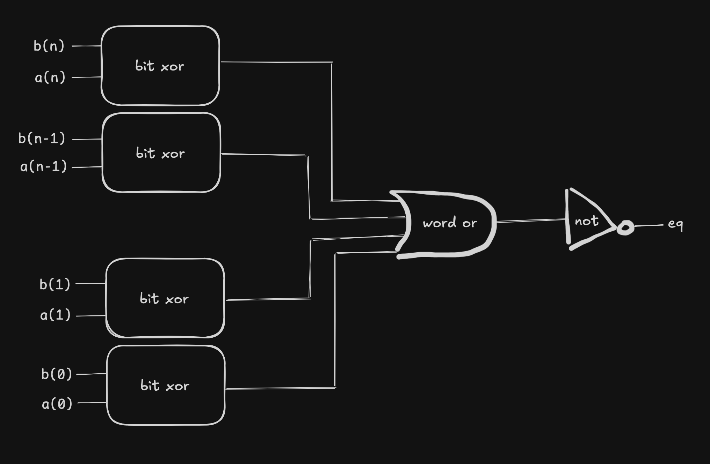

# Problem

Suppose you want to implement a word-level equality circuit using the `EXCLUSIVE-OR`
circuits from Problem 4.9 rather than from bit-level equality circuits. Design
such a circuit for a 64-bit word consisting of 64 bit level `EXCLUSIVE-OR` circuits and
two additional logic gates.

## Answer

