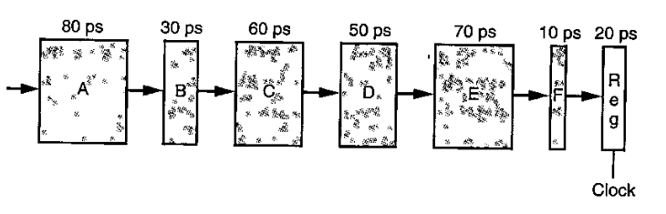

# Problem 28

Suppose we analyze the combinational logic of Figure 4.32 and determine that it
can be separated into a sequence of six blocks, named A to F, having delays of 80,
30, 60, 50, 70, and 10 ps, respectively, illustrated as follows:

We can create pipelined version of this design by inserting pipeline registers
between pairs of these blocks. Different combinations of pipeline depth (how
many stages) and maximum throughput arise, depending on where we insert the
pipeline registers. Assume that a pipeline register has a delay of 20 ps.

- (a) Inserting a single register gives a two-stage pipeline. Where should the
  register be inserted to maximize throughput? What would be the throughput
  and latency?

- (b) Where should two registers be inserted to maximize the throughput of a
  three-stage pipeline? What would be the throughput and latency?

- (c) Where should three registers be inserted to maximize the throughput of a
  four-stage pipeline? What would be the throughput and latency?

- (d) What is the maximum number of stages that would yield a design with the
  maximum achievable throughput? Describe this design, its throughput and its latency.

## Answers

### (a)

- [A,B,C]->[R]->[D,E,F]
- Throughput = 1/(170 + 20) \* 1000 = 5.26 GIPS
- Latency = 2 \* 190 = 380ps

### (b)

- [A,B]->[R]->[C,D]->[R]->[E,F]
- Throughput = 1/(110 + 20) \* 1000 = 7.69 GIPS
- Latency = 3 \* 130 = 390ps

### (c)

- [A]->[R]->[B,C]->[R]->[D]->[R]->[E,F]
- Throughout = 1 / (90 + 20) \* 1000 = 9.09 GIPS
- Latency = 4 \* 110 = 440ps

### (d)

- 4 registers
- [A]->[R]->[B]->[R]->[C]->[R]->[D]->[R]->[E,F]
- Throughout = 1/(80 + 20) \* 1000 = 10 GIPS
- Latency = 5 \* 100 = 500ps
