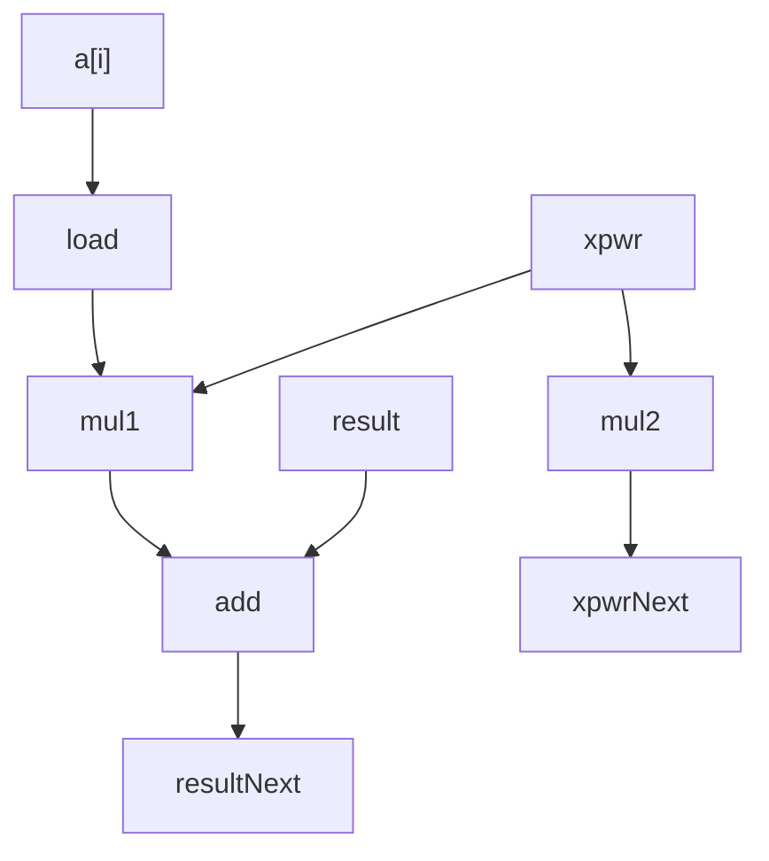

# Problem 5

Suppose we wish to write a function to evaluate a polynomial, where a polynomial
of degree `n` is defined to have a set of coefficients a0, a1, a2, ... , aN. For a value `x`,
we evaluate the polynomial by computing

- a0 + a1x + a2(x^2) + ... + aN(x^N)

This evaluation can be implemented by the following function, having as arguments
an array of coefficients `a`, a value `x` and the polynomial degree `degree` (the
value `N`). In this function, we compute both the successive terms
of the equation and the successive powers of `x` within a single loop:

```C
double poly(double a[], double x, long degree) {
    long i;
    double result = a[0];
    double xpwr = x; /* Equals x^i at start of loop */
    for (i = 1; i <= degree; i++) {
        result += a[i] * xpwr;
        xpwr = x * xpwr;
    }
    return result;
}
```

- (a) For degree `n`, how many additions and how many multiplications does this code perform?

- (b) On our reference machine, with arithmetic operation having the latencies
  shown in Figure 5.12, we measure the CPE for this function to be 5.00. Explain
  how this CPE arises based on the data dependencies formed between
  iterations due to the operations implementing lines 7-8 of the function

## Answers

### (a)

- One multiplication to compute result increment
- One addition to increment result
- One multiplication to compute next power

- n additions and 2n multiplications

### (b)


