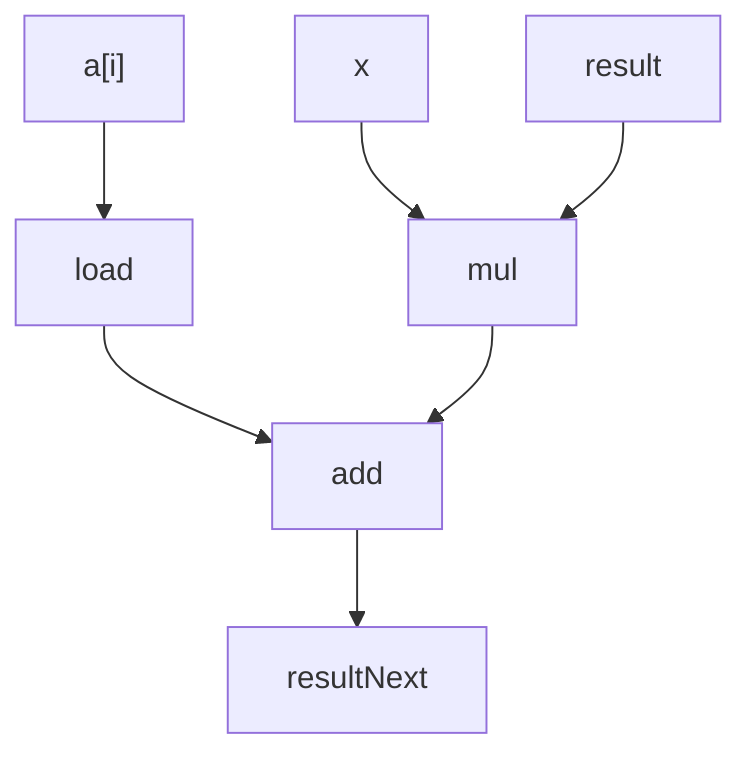

# Problem 6

Let us continue exploring ways to evaluate polynomials as described in Practice
Problem 5.5. We can reduce the number of multiplications in evaluating a polynomial
applying Horner's method, named after British mathematician William G. Horner
(1786-1837). The idea is to repeatedly factor out the powers of `x` to get
the following evaluation

- a0 + x(a1 + x(a2 + ... + x(a(n-1) + xa(n))))

Using Horners method, we can implement polynomial evaluation using the
following code

```C
/* Apply Horner's Method */
double polyh(double a[], double x, long degree) {
    long i;
    double result = a[degree];
    for (i = degree - 1; i >= 0; i--) {
        result = a[i] + x * result;
    }
    return result;
}
```

- (a) For degree `n` how many additions and how many multiplications does this code perform?

- (b) On our reference machine, with the arithmetic operations having latencies showin Figure 5.12
  we measure the CPE for this function to be 8.00. Explain how this CPE arises based on the
  data dependencies formed between iterations due to the operations implementing line 7 of the function

- (c) Explain how the function shown in Practice Problem 5.5 can run faster, even though it requires
  more operations

## Answers

### (a)

- `n` additions and `n` multiplications

### (b)

1 mul (5 cycles) and 1 add (3 cycles) are required per iteration



### (c)

It can ran faster as the instructions can be run in parallel. Only a single mul instruction
is run along the critical path per iteration
